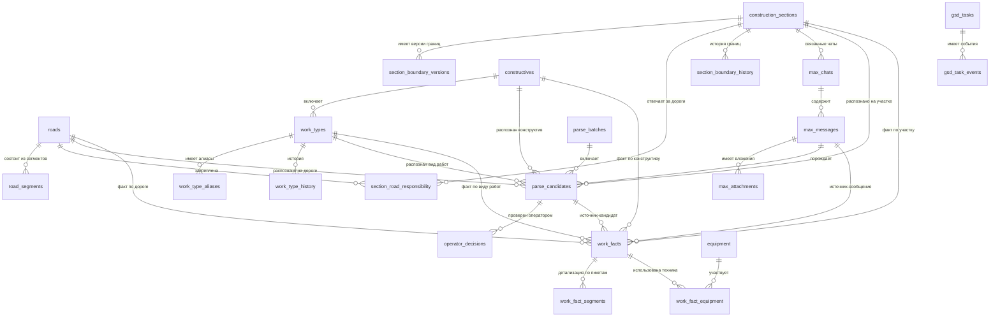

# Схема БД works_db

Ниже — читаемое описание структуры базы данных с русскими названиями и связями.

## 1. Справочники и нормативная база

### `construction_sections` — **Участки строительства**
Хранит список строительных участков.

Поля:
- `id` — идентификатор
- `code` — код участка
- `name` — название участка
- `is_active` — активен ли участок
- `created_at` — дата создания

Связи:
- 1:N с `section_boundary_versions`
- 1:N с `section_road_responsibility`
- 1:N с `max_chats`
- 1:N с `parse_candidates`
- 1:N с `work_facts`

Пример:
- `UCH_1` → `Уч. 1`

---

### `section_boundary_versions` — **Версии границ участков**
История/версии границ участка в пикетах.

Поля:
- `section_id` — ссылка на участок
- `valid_from`, `valid_to` — период действия версии
- `pk_start_text`, `pk_end_text` — текстовые границы
- `pk_start_m`, `pk_end_m` — границы в метрах
- `is_current` — актуальная версия
- `note` — примечание

Связи:
- N:1 к `construction_sections`

---

### `roads` — **Дороги / объекты линейной привязки**
Список дорог, основного хода, технологических проездов и т.п.

Поля:
- `code` — код дороги
- `name` — название дороги
- `road_type` — тип дороги
- `is_active` — активность

Связи:
- 1:N с `road_segments`
- 1:N с `section_road_responsibility`
- 1:N с `parse_candidates`
- 1:N с `work_facts`

Типовые значения `road_type`:
- `main_track` — основной ход
- `temporary_access_road` — временная/притрассовая дорога
- `unknown` — не определено

---

### `road_segments` — **Сегменты дорог**
Позволяет задать диапазоны пикетов для дороги.

Поля:
- `road_id` — ссылка на дорогу
- `pk_start_m`, `pk_end_m` — границы сегмента
- `pk_start_text`, `pk_end_text` — текстовые границы
- `note` — примечание

Связи:
- N:1 к `roads`

---

### `section_road_responsibility` — **Ответственность участка за дорогу**
Показывает, какой участок отвечает за какую дорогу в определённом диапазоне и периоде.

Поля:
- `section_id` — участок
- `road_id` — дорога
- `valid_from`, `valid_to` — период действия
- `pk_start_m`, `pk_end_m` — границы
- `pk_start_text`, `pk_end_text` — границы текстом
- `note` — примечание

Связи:
- N:1 к `construction_sections`
- N:1 к `roads`

---

### `constructives` — **Конструктивы**
Крупные категории строительных объектов.

Поля:
- `code` — код конструктива
- `name` — название
- `sort_order` — порядок сортировки
- `is_active` — активность

Связи:
- 1:N с `work_types`
- 1:N с `parse_candidates`
- 1:N с `work_facts`

Примеры:
- `POH` — Основной ход
- `VPD` — Временные подъездные дороги

---

### `work_types` — **Виды работ**
Справочник видов работ внутри конкретного конструктива.

Поля:
- `constructive_id` — конструктив
- `code` — код вида работ
- `name` — название работы
- `unit` — единица измерения
- `report_group` — группа для отчётности
- `sort_order` — сортировка
- `is_ambiguous` — неоднозначный тип
- `is_active` — активность

Связи:
- N:1 к `constructives`
- 1:N с `work_type_aliases`
- 1:N с `parse_candidates`
- 1:N с `work_facts`
- 1:N с `work_type_history`

Примеры:
- `CUT_SOIL` — Разработка грунта
- `SOIL_REPLACEMENT` — Замена слабого грунта
- `DITCH_WORK` — Устройство водоотводной канавы

---

### `work_type_aliases` — **Алиасы / шаблоны распознавания видов работ**
Нужны для сопоставления текстов из сообщений/Excel с нормативным видом работ.

Поля:
- `work_type_id` — вид работ
- `alias_text` — текстовый шаблон
- `match_mode` — режим сопоставления
- `priority` — приоритет
- `is_active` — активность

Связи:
- N:1 к `work_types`

---

### `equipment` — **Техника**
Справочник техники.

Поля:
- `code` — код
- `equipment_type` — тип техники
- `fleet_number` — бортовой/условный номер
- `model` — модель
- `owner_name` — владелец
- `is_active` — активность

Связи:
- 1:N с `work_fact_equipment`

Примеры типов:
- Самосвал
- Экскаватор
- Бульдозер

---

## 2. Контур задач и контроля

### `gsd_tasks` — **Задачи / backlog / контрольные вопросы**
Используется для фиксации проблем, блокеров, следующего действия.

Поля:
- `code` — код задачи
- `title` — заголовок
- `description` — описание
- `entity_type`, `entity_id` — к чему относится
- `status` — статус
- `priority` — приоритет
- `owner_name` — ответственный
- `next_action` — следующее действие
- `due_date` — срок
- `blocker_reason` — причина блокера
- `resolution_note` — как закрыто

Связи:
- 1:N с `gsd_task_events`

---

### `gsd_task_events` — **События по задачам**
Журнал изменений статусов и комментариев по задаче.

Поля:
- `task_id` — задача
- `event_type` — тип события
- `old_status`, `new_status` — старый/новый статус
- `comment` — комментарий
- `actor_name` — кто сделал
- `created_at` — когда

Связи:
- N:1 к `gsd_tasks`

---

## 3. Контур чатов и первичных сообщений

### `max_chats` — **Чаты MAX**
Справочник чатов/групп, откуда могут приходить отчёты.

Поля:
- `max_chat_id` — внешний ID чата
- `section_id` — связанный участок
- `name` — название чата
- `chat_kind` — тип чата
- `is_active` — активность

Связи:
- N:1 к `construction_sections`
- 1:N с `max_messages`

---

### `max_messages` — **Сообщения MAX**
Сырые сообщения, из которых затем выделяются кандидаты в работы.

Поля:
- `max_message_id` — внешний ID сообщения
- `chat_id` — чат
- `sender_id`, `sender_name` — отправитель
- `sent_at` — время отправки
- `report_date` — дата отчёта
- `shift` — смена
- `text_raw` — исходный текст
- `reply_to_message_id` — ответ на сообщение
- `parsed_status` — статус разбора

Связи:
- N:1 к `max_chats`
- 1:N с `max_attachments`
- 1:N с `parse_candidates`
- 1:N с `work_facts` через `source_message_id`

---

### `max_attachments` — **Вложения сообщений**
Файлы/фото/вложения, связанные с сообщением.

Поля:
- `message_id` — сообщение
- `attachment_type` — тип вложения
- `file_name` — имя файла
- `file_url` — ссылка
- `payload_json` — дополнительные метаданные

Связи:
- N:1 к `max_messages`

---

## 4. Контур разбора входящих данных

### `parse_batches` — **Пакеты разбора**
Группирует процесс разбора сообщений за дату/период.

Поля:
- `report_date` — дата отчёта
- `started_at`, `finished_at` — время запуска/окончания
- `status` — статус пакета
- `created_by` — кем создан
- `note` — комментарий

Связи:
- 1:N с `parse_candidates`

---

### `parse_candidates` — **Кандидаты на распознанные работы**
Промежуточные результаты автоматического разбора.

Поля:
- `batch_id` — пакет разбора
- `message_id` — исходное сообщение
- `section_id`, `road_id`, `constructive_id`, `work_type_id` — предполагаемые классификаторы
- `confidence` — уверенность
- `volume`, `unit` — объём и единица
- `pk_raw_text` — исходная пикетная привязка
- `comment` — комментарий
- `candidate_json` — сырой JSON результата
- `decision_status` — статус решения
- `gsd_status` — нужен ли разбор человеком

Связи:
- N:1 к `parse_batches`
- N:1 к `max_messages`
- N:1 к `construction_sections`
- N:1 к `roads`
- N:1 к `constructives`
- N:1 к `work_types`
- 1:N с `operator_decisions`
- 1:N с `work_facts` через `source_candidate_id`

---

### `operator_decisions` — **Решения оператора**
Ручные подтверждения/исправления кандидатов.

Поля:
- `candidate_id` — кандидат
- `decision` — решение (принять/отклонить/исправить)
- `operator_name` — оператор
- `final_section_id`, `final_road_id`, `final_constructive_id`, `final_work_type_id` — финальные значения
- `final_volume`, `final_unit` — итоговый объём
- `final_comment` — комментарий
- `decided_at` — время решения

Связи:
- N:1 к `parse_candidates`

---

## 5. Фактические работы и эксплуатация техники

### `work_facts` — **Факты выполненных работ**
Главная таблица факта: что, где, когда и в каком объёме выполнено.

Поля:
- `report_date` — дата отчёта
- `shift` — смена
- `section_id` — участок
- `road_id` — дорога
- `constructive_id` — конструктив
- `work_type_id` — вид работ
- `volume` — объём
- `unit` — единица
- `pk_raw_text` — исходная привязка
- `source_candidate_id` — источник-кандидат
- `source_message_id` — источник-сообщение
- `source_kind` — тип источника
- `approval_status` — статус подтверждения
- `gsd_status` — статус контроля

Связи:
- N:1 к `construction_sections`
- N:1 к `roads`
- N:1 к `constructives`
- N:1 к `work_types`
- N:1 к `parse_candidates`
- N:1 к `max_messages`
- 1:N с `work_fact_segments`
- 1:N с `work_fact_equipment`

---

### `work_fact_segments` — **Сегменты факта работ**
Если работа выполнена на интервале пикетов — здесь лежит детализация диапазона.

Поля:
- `work_fact_id` — факт работы
- `pk_start_m`, `pk_end_m` — границы
- `pk_start_text`, `pk_end_text` — текстовые значения
- `note` — комментарий

Связи:
- N:1 к `work_facts`

---

### `work_fact_equipment` — **Использование техники в факте работ**
Привязка техники к выполненной работе.

Поля:
- `work_fact_id` — факт работы
- `equipment_id` — техника
- `shift` — смена
- `trips_count` — число рейсов/выходов
- `worked_volume` — объём работы техникой
- `note` — комментарий

Связи:
- N:1 к `work_facts`
- N:1 к `equipment`

---

## 6. История изменений нормативов

### `work_type_history` — **История изменений видов работ**
Журнал переименований/изменений единиц измерения по виду работ.

Связи:
- N:1 к `work_types`

### `section_boundary_history` — **История изменений границ участков**
Журнал изменений границ участка.

Связи:
- N:1 к `construction_sections`

---

## 7. Технические staging-таблицы импорта

> Эти таблицы использует импортёр Excel. Они, вероятно, были созданы позже отдельным SQL, но логически являются частью системы.

### `excel_import_snapshots` — **Снимки строк Excel при импорте**
Нужны для фиксации исходных строк из Excel.

Типовые поля по использованию импортёром:
- `report_date`
- `source_sheet`
- `row_code`
- `section_code`
- `pk_raw_text`
- `work_name`
- `unit`
- `month_done_volume`
- `cumulative_done_volume`

### `import_errors` — **Ошибки импорта**
Сюда пишутся неразобранные строки, ошибки маппинга и проблемы чтения.

Типовые поля по использованию импортёром:
- `source_kind`
- `report_date`
- `source_sheet`
- `source_row`
- `row_code`
- `error_type`
- `error_message`
- `payload_json`

---

## 8. Представления (views)

### `v_work_daily` — **Дневная сводка работ**
Агрегирует факт работ по дате, участку, дороге, конструктиву и виду работ.

Показывает:
- дата
- участок
- дорога
- конструктив
- вид работ
- единица
- объём за день

### `v_work_cumulative` — **Накопительная сводка**
Строится поверх `v_work_daily` и считает накопительный итог по дням.

### `v_gsd_task_summary` — **Сводка по задачам GSD**
Группирует задачи по статусу и приоритету.

---

# Mermaid ER-диаграмма

---

# Примеры бизнес-сценариев

## Сценарий 1. Импорт Excel
1. Строка из Excel сохраняется в `excel_import_snapshots`.
2. Система пытается определить участок, дорогу, конструктив и вид работ.
3. Если всё распознано — создаётся запись в `work_facts`.
4. Если есть диапазон пикетов — создаются записи в `work_fact_segments`.
5. Если есть техника — создаются записи в `work_fact_equipment`.
6. Если что-то не распознано — пишется строка в `import_errors`.

## Сценарий 2. Разбор сообщений
1. Сообщение приходит в `max_messages`.
2. Запускается `parse_batch`.
3. Создаются `parse_candidates`.
4. Оператор может внести `operator_decisions`.
5. После подтверждения формируется `work_facts`.

## Сценарий 3. Отчётность
- `v_work_daily` — сколько сделали за конкретный день.
- `v_work_cumulative` — накопительный итог по объекту/виду работ.
- `v_gsd_task_summary` — сколько открытых/критичных задач.
